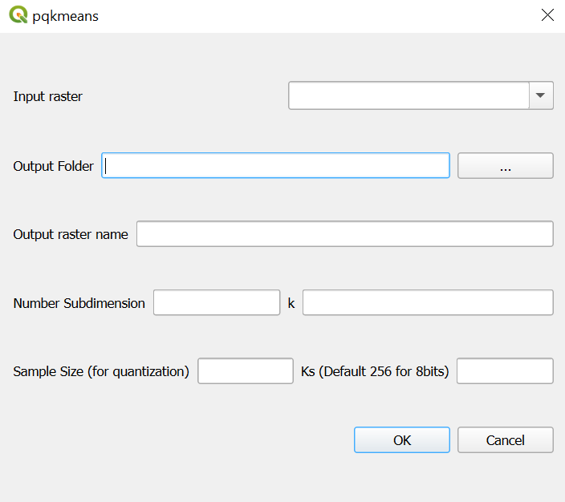

# pqkmeans-qgis-plugin
This QGIS plugin is a quantized version of the clustering algorithm K-Means, used for image classification. It is memory and computationally more efficient than the original algorithym.

To install pqkmeans_clustering plugin in QGIS, you need to install the reloader plugin as follow:
- plugins > Manage and install plugins > (install Plugin Reloader)
- clone the repository https://github.com/arngolo/pqkmeans-qgis-plugin and copy the pqkmeans_clustering directory into the QGIS plugin directory as specified in the `pqkmeans_clustering/README.txt` file.

- Install the dependencies by running the requirements.txt file (use the osgeo4w terminal for windows / ossgeo4mac terminal for mac).
```pip install -r requirements.txt```
- Install cmake: pqkmeans library requires cmake:

  - If cmake is not available from OSGEOW4 shell, check from the default command prompt.
     ```cmake --version```

  - From the OSGEO4W shell type ```echo %path%``` to check where libraries such as python and qt are installed (~\apps)

  - Once done, from the shell type $dir and copy the path.

  - Download and install cmake. install in the same directory where other libraries (python, qt are installed: <dir_output>\apps\CMake)

  - Once the installation is finished, from the OSGEO4W shell add cmake path to PATH!!!:

     ```set PATH=<dir_output>\apps\Cmake\bin;%PATH%```


 - Reload the pluging using the reloader plugin that you previiously installed
 - Open the plugin. The UI will look as bellow:
 

## Development environment

|  Software/library        |  version               |
|:------------------------:|:----------------------:|
| QGIS                     |  3.34.3-Prizren        |
| Qt                       |  5.15.3                |
| Python                   |  3.9.18                |
| GDAL/OGR                 |  3.8.3                 |
| PROJ                     |  9.3.1                 |
| EPSG registry database   |  v10.098 (2023-11-24)  |
| GEOS                     |  3.12.1-CAPI-1.18.1    |
| SQLite                   |  3.41.1                |
| PDAL                     |  2.6.0                 |
| PostgreSQL client        |  15.2                  |
| SpatiaLite               |  5.1.0                 |
| rasterio                 |  1.3.9                 |
| pqkmeans                 |  1.0.6                 |
| cmake                    |  3.3.8.2               |
| QWT                      |  6.1.6                 |
| QScintilla2              |  2.13.4                |
| OS                       |  Windows 10, 2009      |

## TO-DO
- update Readme
- publish the plugin